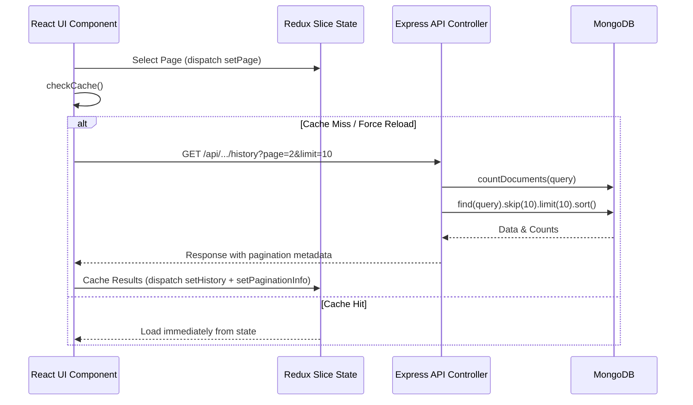

# Technical Story: End-to-End Pagination

This document details the architecture and implementation of pagination within the Employee Management System, coordinating parameters across the UI components, Redux state slices, REST APIs, and MongoDB/Mongoose query bounds.

---

## 1. System Overview

Pagination is used across all log grids (Attendance, Leaves, Payroll, and Employee lists) to optimize database throughput and minimize network payloads.



---

## 2. Backend Implementation (Express & Mongoose)

All paginated routes utilize a standard parameters contract validated via Zod schemas and processed inside Mongoose controllers.

### A. Route Validation
Query parameters are optional but must conform to positive integer constraints if specified.
* **Schema File**: `backend/src/schemas/ownerSchemas.js` or `backend/src/schemas/leaveSchemas.js`
* **Validation Middleware**: `backend/src/middleware/validationMiddleware.js`

```javascript
// Schema validation definition (e.g. for leave history query)
historyQuery: z.object({
    targetUserId: common.objectId.optional(),
    page: z.coerce.number().int().positive().optional(),
    limit: z.coerce.number().int().positive().max(1000).optional()
})
```

### B. Controller Logic
Inside paginated controller methods (e.g., `getAttendanceHistory`, `getLeaveHistory`, `getPayrollHistory`, `searchUsers`), the math and database query bounds are executed as follows:

* **Offset Formula**:
  $$\text{skip} = (\text{page} - 1) \times \text{limit}$$
* **Calculation & Query Sequence**:
  1. Parse values with defaults: `pageNum = parseInt(page) || 1` and `limitNum = parseInt(limit) || 10`.
  2. Count documents matching the target query scope: `total = await Model.countDocuments(query)`.
  3. Fetch the sliced subset: `data = await Model.find(query).skip(skip).limit(limitNum).sort(sortOptions)`.
  4. Compute structural variables:
     $$\text{totalPages} = \lceil\text{total} / \text{limitNum}\rceil$$
     $$\text{hasNext} = \text{pageNum} < \text{totalPages}$$
     $$\text{hasPrev} = \text{pageNum} > 1$$

* **Controller Implementation Example**:
```javascript
const pageNum = parseInt(page) || 1;
const limitNum = parseInt(limit) || 10;
const skip = (pageNum - 1) * limitNum;

const total = await Leave.countDocuments(query);
const leaves = await Leave.find(query)
    .populate('user', 'fullName email position identity')
    .sort({ createdAt: -1 })
    .skip(skip)
    .limit(limitNum);

const totalPages = Math.ceil(total / limitNum);

return res.status(200).json({
    success: true,
    data: leaves,
    pagination: {
        page: pageNum,
        limit: limitNum,
        total,
        totalPages,
        hasNext: pageNum < totalPages,
        hasPrev: pageNum > 1
    }
});
```

---

## 3. Frontend Architecture (React & Redux Toolkit)

The frontend manages pagination indices locally in Redux states, updates them via navigation components, and evaluates query states during page transitions to control cache hits.

### A. Redux State Properties
Each slice (e.g., `leavesSlice.js`, `attendanceSlice.js`, `payrollSlice.js`, `employeesSlice.js`) separates pagination params from payload lists:
```javascript
const initialState = {
  leaves: [],
  loading: true,
  page: 1,
  limit: 10,
  paginationInfo: {
    total: 0,
    totalPages: 1,
    hasNext: false,
    hasPrev: false
  },
  isCached: false,
  cachedParams: null
};
```

### B. Cache Validation Flow
When fetching lists, the logic compares current user selections against the parameters used in the last API request:
```javascript
const fetchLeaves = (force = false) => async (dispatch, getState) => {
  const { page, limit, isCached, cachedParams } = getState().leaves.employee;
  
  if (!force && isCached && cachedParams && 
      cachedParams.page === page && 
      cachedParams.limit === limit) {
    return; // Retrieve from store state, bypass network
  }
  
  // Cache miss: Trigger API request
  dispatch(setEmployeeLoading(true));
  try {
    const res = await axiosInterceptors.get(`/leaves/history?page=${page}&limit=${limit}`);
    dispatch(setEmployeeLeaves(res.data.data));
    dispatch(setEmployeePaginationInfo(res.data.pagination));
  } catch (error) {
    toastError(error);
  } finally {
    dispatch(setEmployeeLoading(false));
  }
};
```

### C. UI Component rendering (`Pagination.jsx`)
The reusable `Pagination.jsx` component renders page triggers and button controls.
* **Component Path**: `frontend/src/components/common/Pagination.jsx`
* **Props interface**:
  - `page`: Current active page.
  - `totalPages`: Number of available pages.
  - `onPageChange`: Function triggered when a page button is clicked (dispatches action changing Redux page state and invokes fetch).
  - `hasNext`: Button enabled state for "Next".
  - `hasPrev`: Button enabled state for "Previous".
