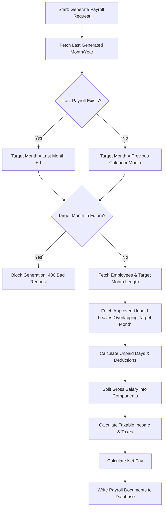

# Technical Story: Payroll Mathematical Formula & Calculations

This document details the financial algorithms, tax brackets, component breakdowns, and unpaid leave deduction formulas implemented in the Payroll module.

---

## 1. Payroll Generation Pipeline



---

## 2. Sequential Period Calculation

To prevent gaps in payroll records, the backend automatically targets the next sequential month rather than letting the owner choose random months.

* **Target Period Logic**:
  - The controller queries the newest database entry: `Payroll.findOne({ company: companyId }).sort({ year: -1, month: -1 })`.
  - If a record is found:
    - Target month is incremented: `month = lastPayroll.month + 1`, `year = lastPayroll.year`.
    - If target month exceeds 12, it wraps around: `month = 1`, `year = year + 1`.
    - **Future Block**: A date object checks bounds: `if (year > currentYear || (year === currentYear && month > currentMonth))` -> blocks creation.
  - If no payroll records exist yet:
    - Defaults to the previous calendar month: `month = currentMonth - 1`. If current month is January, it targets `month = 12`, `year = currentYear - 1`.

---

## 3. Financial Formulas

The calculation logic iterates over each company employee. Let $S_{\text{gross}}$ be the employee's monthly gross salary (pre-configured in their User record).

### A. Component Breakdowns
The gross salary is split into standard allowances and base payouts:
* **Basic Pay** ($P_{\text{basic}}$): 50% of Gross
  $$P_{\text{basic}} = S_{\text{gross}} \times 0.50$$
* **House Rent Allowance** ($P_{\text{hra}}$): 30% of Gross
  $$P_{\text{hra}} = S_{\text{gross}} \times 0.30$$
* **Conveyance Allowance** ($P_{\text{conveyance}}$): 10% of Gross
  $$P_{\text{conveyance}} = S_{\text{gross}} \times 0.10$$
* **Medical Allowance** ($P_{\text{medical}}$): 10% of Gross
  $$P_{\text{medical}} = S_{\text{gross}} \times 0.10$$
* **Bonus** ($P_{\text{bonus}}$): Defaults to $0$
* **Gross Pay** ($P_{\text{gross}}$):
  $$P_{\text{gross}} = P_{\text{basic}} + P_{\text{hra}} + P_{\text{conveyance}} + P_{\text{medical}} + P_{\text{bonus}} = S_{\text{gross}}$$

### B. Unpaid Leave Deductions ($D_{\text{leaves}}$)
Deductions are calculated based on the number of calendar days in the target month ($N_{\text{days}}$) and the number of approved unpaid leave days ($L_{\text{unpaid}}$) falling within that month:
1. **Daily Wage Rate** ($W_{\text{daily}}$):
   $$W_{\text{daily}} = \frac{S_{\text{gross}}}{N_{\text{days}}}$$
   *(where $N_{\text{days}}$ is determined dynamically via `new Date(year, month, 0).getDate()`)*
2. **Leave Overlap Calculation**:
   - The query filters approved unpaid leaves: `{ company: companyId, status: "approved", type: "unpaid" }` overlapping the month boundaries.
   - For each matching leave, overlapping days are computed:
     $$\text{Start}_{\text{overlap}} = \max(\text{leave.startDate}, \text{month.startDate})$$
     $$\text{End}_{\text{overlap}} = \min(\text{leave.endDate}, \text{month.endDate})$$
     $$\text{Overlapping Days} = \text{round}\left(\frac{\text{End}_{\text{overlap}} - \text{Start}_{\text{overlap}}}{1 \text{ day}}\right) + 1$$
3. **Total Leave Deduction** ($D_{\text{leaves}}$):
   $$D_{\text{leaves}} = \text{round}(L_{\text{unpaid}} \times W_{\text{daily}})$$

### C. Taxable Income ($I_{\text{taxable}}$) & Tax Deductions ($T_{\text{tax}}$)
Taxes are evaluated against a progressive threshold based on the monthly taxable income:
1. **Taxable Income**:
   $$I_{\text{taxable}} = P_{\text{gross}} - D_{\text{leaves}}$$
2. **Tax Deductions**:
   - **Under ₹50,000 threshold**: $0\%$ tax rate.
     $$T_{\text{tax}} = 0 \quad (\text{if } I_{\text{taxable}} \le 50,000)$$
   - **Over ₹50,000 threshold**: $10\%$ flat tax rate on the taxable amount.
     $$T_{\text{tax}} = \text{round}(I_{\text{taxable}} \times 0.10) \quad (\text{if } I_{\text{taxable}} > 50,000)$$

### D. Final Net Pay ($P_{\text{net}}$)
The final net salary disbursed to the employee's account is computed as:
$$P_{\text{net}} = I_{\text{taxable}} - T_{\text{tax}} = P_{\text{gross}} - D_{\text{leaves}} - T_{\text{tax}}$$
*(This represents the actual net payout deposited into MongoDB)*

---

## 4. Code Implementation Details

* **Controller Path**: `backend/src/controllers/payrollController.js`
* **Target Method**: `generateCompanyPayroll`

```javascript
const grossSalary = user.salary || 0;
const dailyWage = grossSalary / daysInMonth;
const unpaidDays = leaveDeductionsByUser[user._id.toString()] || 0;
const unpaidLeaveDeductions = Math.round(unpaidDays * dailyWage);

const basicPay = Math.round(grossSalary * 0.5);
const hra = Math.round(grossSalary * 0.3);
const conveyance = Math.round(grossSalary * 0.1);
const medical = Math.round(grossSalary * 0.1);
const bonus = 0;
const grossPay = basicPay + hra + conveyance + medical + bonus;

const taxableIncome = grossPay - unpaidLeaveDeductions;
const taxes = taxableIncome > 50000 ? Math.round(taxableIncome * 0.1) : 0;
const netPay = taxableIncome - taxes;
```
