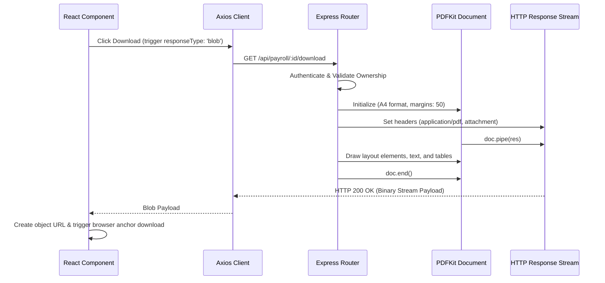

# Technical Story: Payslip PDF Generation & Downloads

This document explains the technical implementation of PDF payslip generation and client-side downloads within the Employee Management System, utilizing the `pdfkit` library on Node.js and REST binary streams.

---

## 1. Flow Diagram



---

## 2. Backend PDF Generation (`pdfkit`)

The server leverages `pdfkit` to generate A4 format, multi-column payslip documents in real-time.

* **Controller file**: `backend/src/controllers/payrollController.js`
* **Methods**: `downloadPayslip` (individual month) and `downloadTenurePayslip` (consolidated career earnings statement).

### A. HTTP Header Setup
To instruct the browser to treat the incoming payload as a downloadable file transfer rather than inline JSON, the HTTP headers are configured first:
```javascript
res.setHeader("Content-Type", "application/pdf");
res.setHeader("Content-Disposition", `attachment; filename="${filename}"`);
```

### B. PDF Setup & Streaming
Instantiate the document and pipe its output directly into the Express response stream `res`:
```javascript
const PDFDocument = require("pdfkit");
const doc = new PDFDocument({ margin: 50, size: 'A4' });

doc.pipe(res); // Streams output chunks to client as they are generated
```

### C. Design & Drawing Coordinates
`pdfkit` works by absolute grid coordinate positions (points, where 72 points = 1 inch). The layouts use text alignments, line drawings, and tables:

- **Horizontal Separation Lines**:
  ```javascript
  doc.moveTo(50, doc.y).lineTo(550, doc.y).strokeColor('black').stroke();
  doc.moveDown(0.5);
  ```
- **Grid / Multi-column Layouts**:
  By storing coordinates, we can print items in side-by-side columns:
  ```javascript
  const detailsY = doc.y;
  doc.text(`Name: ${payroll.user.fullName}`, 50, detailsY); // Column 1
  doc.text(`Email: ${payroll.user.email}`, 300, detailsY);  // Column 2
  ```
- **Dynamic Page Breaks**:
  For consolidated statements containing multiple rows (e.g. tenure breakdown), we audit the vertical cursor `doc.y` to append a new page before drawing overlaps the page bottom (usually ~750-800 points):
  ```javascript
  for (const record of payrollHistory) {
      if (doc.y > 750) {
          doc.addPage();
          // Draw table header on new page
          ...
      }
      // Print row details
  }
  ```
- **Completing Generation**:
  Closing the document triggers the write stream finish:
  ```javascript
  doc.end();
  ```

---

## 3. Frontend Binary Blob Download Handler

Because the application relies on an Axios client configuration using credentials and JWT auth headers, standard navigation links (`<a href="...">`) cannot be used because they don't carry headers. Instead, files are retrieved as binary blobs and saved programmatically.

* **Trigger Location**: `frontend/src/features/payroll/EmployeePayroll.jsx` or `OwnerPayroll.jsx`

### Code Implementation:
```javascript
const handleDownload = async (recordId, filename) => {
  try {
    // 1. Send request with responseType 'blob' to receive raw binary data
    const res = await axiosInterceptors.get(`/payroll/${recordId}/download`, {
      responseType: 'blob',
    });

    // 2. Wrap binary payload into a Javascript Blob object
    const blob = new Blob([res.data], { type: 'application/pdf' });

    // 3. Create a temporary object URL representing the Blob
    const url = window.URL.createObjectURL(blob);

    // 4. Create and trigger a virtual DOM anchor link
    const link = document.createElement('a');
    link.href = url;
    link.setAttribute('download', filename || `payslip_${recordId}.pdf`);
    document.body.appendChild(link);
    link.click();

    // 5. Cleanup DOM and release memory
    link.parentNode.removeChild(link);
    window.URL.revokeObjectURL(url);
  } catch (error) {
    toastError(error, "Failed to download payslip.");
  }
};
```
