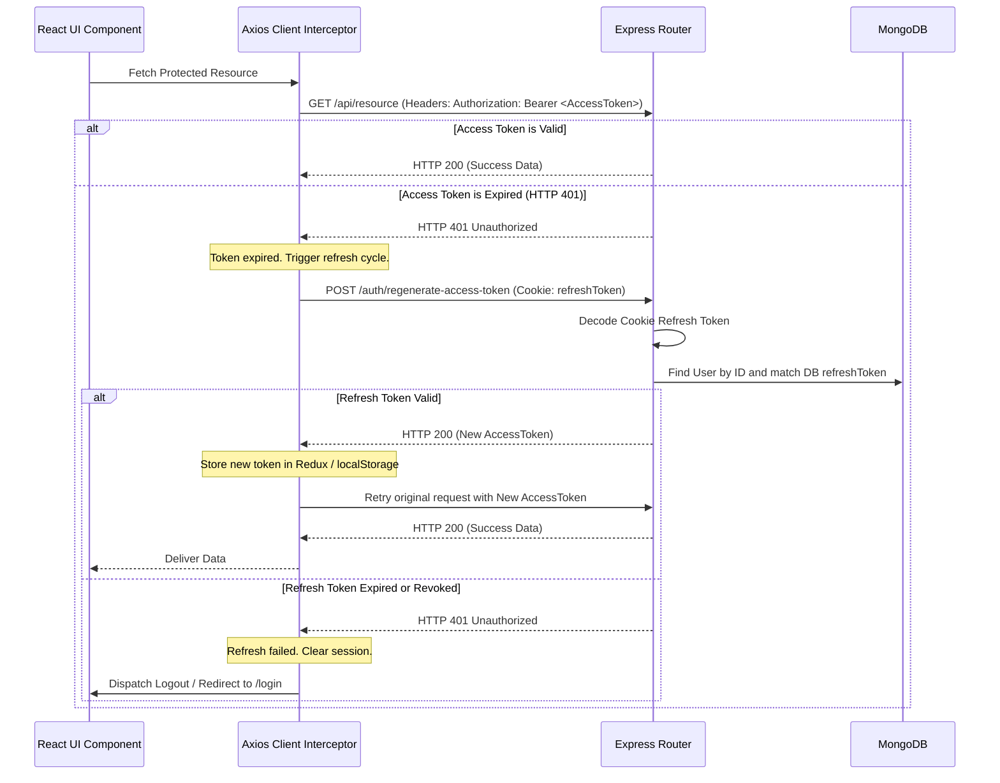

# Technical Story: JWT Token Management & Auto-Regeneration

This document details the secure session and token management architecture, coordinating JSON Web Tokens (JWT), httpOnly cookies, Axios interceptors, and automatic token refresh flows across the stack.

---

## 1. Authentication Lifecycle Flow



---

## 2. Token Issuance & Refresh Strategy (Backend)

The server employs a dual-token setup:
1. **Access Token**: Short-lived (15 minutes), containing the user profile and company context. Sent in headers.
2. **Refresh Token**: Long-lived (7 days), stored in the database and sent as an HTTP-only cookie.

* **Helper File**: `backend/src/utils/generateTokens.js`
* **Controller File**: `backend/src/controllers/authController.js`

### A. Token Generation
```javascript
const generateAccessToken = (user, company) => {
    const payload = {
        user: { _id: user._id, email: user.email, role: user.role, fullName: user.fullName },
        company: { _id: company._id, companyName: company.companyName } 
    };
    return jwt.sign(payload, process.env.JWT_TOKEN, { expiresIn: "15m" });
};

const generateRefreshToken = (user, company) => {
    ...
    return jwt.sign(payload, process.env.JWT_REFRESH_TOKEN, { expiresIn: "7d" });
};
```

### B. Cookie Configuration (Login Endpoint)
The Refresh Token is transmitted as a secure, httpOnly cookie to prevent cross-site scripting (XSS) access:
```javascript
res.cookie("refreshToken", refreshToken, {
    httpOnly: true, // Prevents Javascript (document.cookie) from accessing the token
    sameSite: "lax",
    secure: process.env.NODE_ENV === "production",
    path: "/",
    maxAge: 7 * 24 * 60 * 60 * 1000 // 7 days in milliseconds
});
```

### C. Access Token Regeneration (`regenerateAccessToken`)
When the access token expires, the client hits `POST /api/auth/regenerate-access-token`:
1. Verifies the cookie refresh token: `jwt.verify(refreshToken, process.env.JWT_REFRESH_TOKEN)`.
2. Validates that the token matches the hashed record in MongoDB: `user.refreshToken === refreshToken`.
3. If they match, returns a fresh access token: `{ accessToken, success: true }`.

---

## 3. Axios Interceptor & Silent Refresh (Frontend)

The client automatically handles authorization header injection and silent access token regeneration without interrupting the user experience.

* **Axios Interceptor Path**: `frontend/src/app/axiosInterceptors.js`

### Code Implementation:
```javascript
import axios from 'axios';
import store from './store.js';
import { logout, setAuthSuccess } from '../features/auth/authSlice.js';
import { navigate } from './navigation.js';

const axiosInterceptors = axios.create({
  baseURL: import.meta.env.VITE_BACKEND_URL,
  withCredentials: true, // Forces sending cookies (refreshToken) with requests
});

// Outgoing Request Interceptor: Injects Authorization Header
axiosInterceptors.interceptors.request.use((config) => {
  const token = localStorage.getItem('token');
  if (token) {
    config.headers.Authorization = `Bearer ${token}`;
  }
  return config;
});

// Incoming Response Interceptor: Handles 401 Token Expirations
axiosInterceptors.interceptors.response.use(
  res => res,
  async error => {
    const originalRequest = error.config;

    // Trigger retry check only on 401s, excluding public auth requests
    if (error.response?.status === 401 && !originalRequest._retry && !originalRequest.url?.includes('/auth/')) {
      originalRequest._retry = true; // Mark request as retrying to prevent endless loops

      try {
        // Request a fresh access token from the backend (transmits httpOnly cookie automatically)
        const res = await axios.post(
          `${import.meta.env.VITE_BACKEND_URL}/auth/regenerate-access-token`,
          {},
          { withCredentials: true }
        );

        const newToken = res.data.accessToken;
        localStorage.setItem('token', newToken);
        
        // Update Redux state with the new access token
        store.dispatch(setAuthSuccess({
          user: store.getState().auth.user,
          accessToken: newToken,
        }));

        // Retry the original request with the new authorization header
        originalRequest.headers.Authorization = `Bearer ${newToken}`;
        return axiosInterceptors(originalRequest);
      } catch (err) {
        // Refresh token failed/expired: Clear session and redirect to login
        store.dispatch(logout());
        navigate('/login');
        return Promise.reject(err);
      }
    }

    return Promise.reject(error);
  }
);
```
