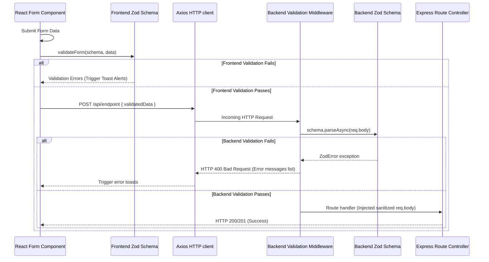

# Technical Story: Cross-Stack Zod Data Validation

This document explains the unified data validation strategy implemented using the `zod` library. It covers schema declarations, backend request/query interceptor middlewares, and frontend form submit validators.

---

## 1. Validation Flow



---

## 2. Reusable Base Rules (`common.js`)

Both sides of the stack share identical validator structures for core fields. These constraints enforce input sanitation (e.g. trimming strings, lowercasing emails, coercing strings to dates or numbers).

* **Backend Common Rules**: `backend/src/schemas/common.js`
* **Frontend Common Rules**: `frontend/src/utils/validation.js`

```javascript
// Base rules definition example
const common = {
  objectId: z.string().regex(/^[0-9a-fA-F]{24}$/, "Invalid ID format"),
  email: z.string().trim().min(1, "Email is required").email("Invalid email format"),
  password: z.string().min(8, "Password must be at least 8 characters"),
  otp: z.coerce.number().int().min(10000, "OTP must be 5 digits").max(99999, "OTP must be 5 digits"),
  phone: z.union([
    z.string().trim().regex(/^\+?[1-9]\d{1,14}$/, "Invalid phone number format"),
    z.literal(""),
    z.literal(undefined)
  ])
};
```

---

## 3. Backend Request Interception (Express Middleware)

All JSON request bodies and URL query parameters undergo automated Zod validation prior to executing controller logic.

* **Middleware Path**: `backend/src/middleware/validationMiddleware.js`

### A. Request Body Interception (`validate`)
Enforces body validation and overrides `req.body` with Zod's sanitized output (stripping unknown parameters and casting data types):
```javascript
const validate = (schema) => async (req, res, next) => {
    try {
        req.body = await schema.parseAsync(req.body);
        next();
    } catch (error) {
        if (error instanceof z.ZodError) {
            const concatenatedMessage = (error.issues || []).map((e) => e.message).join(", ");
            return res.status(400).json({
                success: false,
                message: concatenatedMessage || "Validation failed",
                occurredAt: new Date().toISOString()
            });
        }
        next(error);
    }
};
```

### B. Query Parameters Interception (`validateQuery`)
Similar to the body validator, this converts URL query string attributes into proper data types (e.g., coercing `page="2"` into the integer `2`):
```javascript
const validateQuery = (schema) => async (req, res, next) => {
    try {
        req.query = await schema.parseAsync(req.query);
        next();
    } catch (error) {
        ...
    }
};
```

---

## 4. Frontend Form Submission Validation

Before sending HTTP network requests, React components run local Zod validations. If errors occur, the UI alerts the user via separate toast alerts for each validation failure.

* **Utility Path**: `frontend/src/utils/validation.js`

### Code Implementation:
```javascript
/**
 * Validates form parameters against a schema, triggering error notifications if validation fails.
 * @param {z.ZodSchema} schema - Zod validation schema structure.
 * @param {Object} data - Input form parameter payload.
 * @returns {Object|null} Sanitized parsed data or null on failure.
 */
export const validateForm = (schema, data) => {
  const result = schema.safeParse(data);
  if (!result.success) {
    const errorMessages = (result.error.issues || []).map(err => err.message);
    toastFormErrors(errorMessages);
    return null;
  }
  return result.data;
};

export const toastFormErrors = (messages) => {
  messages.forEach(msg => toast.error(msg));
};
```

---

## 5. Benefits of Dual-Layer Validation

1. **Defense-in-Depth**: Security rules are enforced at the API layer even if client-side validation is bypassed or bypassed by raw API clients (Postman/Curl).
2. **Type Safety & Coercion**: Frontend parameters (like strings from input fields) are safely coerced into actual integers and ISO Dates before submission.
3. **Strip Extra Keys**: Both layers strip unconfigured properties from payloads, preventing parameter injection attacks.
